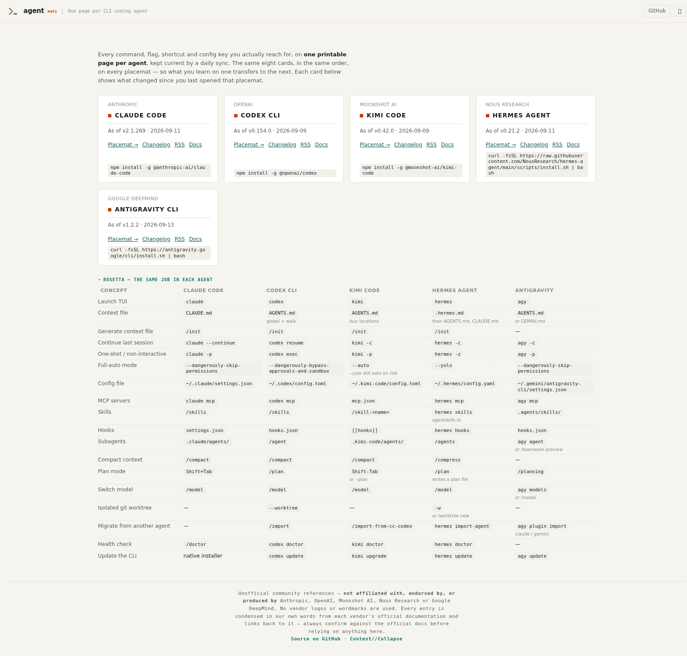

# agentmats

[](https://dommango.github.io/agentmats/)
[](https://github.com/dommango/agentmats/actions/workflows/ci.yml)
[](LICENSE)

Unofficial single-page reference "placemats" for CLI coding agents — every
command, flag, shortcut and config key you actually reach for, on one printable
page per agent, kept current by a daily sync and verified against each
vendor's own docs.

**→ https://dommango.github.io/agentmats/**

<p align="center">
  
</p>

## Why

Every coding agent CLI turns out to have roughly the same eight jobs: keys and
shortcuts, slash commands, CLI flags, settings, environment variables, skills,
and hooks. Each vendor names and shapes them differently, so the knowledge
doesn't obviously transfer — until it's laid out side by side. That's what
agentmats does: one page per agent, in the same order, with the facts
verified against that vendor's own documentation, not against a sibling
placemat's guesswork.

## The Rosetta table — the same job in each agent

The hub's most distinctive feature is the **Rosetta table**: one row per
concept ("launch TUI", "continue last session", "full-auto mode", "switch
model"...), one column per agent, so you can see at a glance that `claude -c`,
`codex resume`, `kimi -c`, `hermes -c` and `agy -c` are all the same job. An
agent that has no equivalent for a row gets `—` rather than a guess.

## The placemats

| Placemat | Agent | Vendor | As of | Official docs |
|---|---|---|---|---|
| [Claude Code](https://dommango.github.io/agentmats/claude-code/) | Claude Code | Anthropic | v2.1.269 | [code.claude.com/docs](https://code.claude.com/docs) |
| [Codex CLI](https://dommango.github.io/agentmats/codex/) | Codex CLI | OpenAI | v0.154.0 | [developers.openai.com/codex](https://developers.openai.com/codex) |
| [Kimi Code](https://dommango.github.io/agentmats/kimi-code/) | Kimi Code | Moonshot AI | v0.42.0 | [moonshotai.github.io/kimi-code](https://moonshotai.github.io/kimi-code/) |
| [Hermes Agent](https://dommango.github.io/agentmats/hermes/) | Hermes Agent | Nous Research | v0.21.2 | [hermes-agent.nousresearch.com](https://hermes-agent.nousresearch.com/docs/) |
| [Antigravity CLI](https://dommango.github.io/agentmats/antigravity/) | Antigravity CLI | Google DeepMind | v1.2.2 | [antigravity.google/docs](https://antigravity.google/docs) |

Every placemat lives at its own directory in this repo (`claude-code/`,
`codex/`, `kimi-code/`, `hermes/`, `antigravity/`) — peers on one shared
template, not five separate projects.

## What you get

- **One page per agent.** Eight cards with the same ids and order everywhere,
  so what you learn on one placemat transfers to the next.
- **A hub** that shows what changed in each agent since *you* last looked at
  its placemat, plus the Rosetta table above.
- **Search** (Ctrl+K) that ignores separators — `ctrl+r` finds `Ctrl R`.
- **Click-to-copy** on every code chip, and a `#` permalink on every row.
- **Print** (Ctrl+P) to an A4-landscape four-column sheet.
- **Atom feeds** per agent, plus a machine-readable `changes.json`.
- No trackers, no external dependencies, no build step.

## Add an agent

Placemats are built from each vendor's own reference, never copied from a
sibling — a card built by analogy is how a previous Antigravity attempt
shipped a dozen commands that didn't exist. The house rule, in
[AGENTS.md § Adding a new agent](AGENTS.md#adding-a-new-agent): extract an
inventory of real commands, settings keys and hook events from the vendor's
docs into that agent's `sources.json` **first**, then build the page against
it. The [new-agent-request](../../issues/new?template=new-agent-request.yml)
issue template walks through it — see
[CONTRIBUTING.md](CONTRIBUTING.md) for the full checklist.

## How it stays current

Each agent has its own daily sync routine and a `PIPELINE.md` describing
exactly what that routine does — a scheduled job, not a person remembering to
check. Every PR also runs through a vendor-inventory gate in
[`tests/placemat.test.js`](tests/placemat.test.js) (the
`command and settings rows are on the verified inventory` tests): any row not
traceable to the declared vendor inventory fails CI outright, rather than
merging as an unverified guess.

## Unofficial

These are community references. They are **not affiliated with, endorsed by,
or produced by** Anthropic, OpenAI, Moonshot AI, Nous Research, or Google
DeepMind. No vendor logos or wordmarks are used. Every entry is condensed in
our own words from the official documentation and links back to it — always
confirm against the official docs before relying on anything here. Spotted
something wrong? Open an issue.

## Local preview

```bash
python3 -m http.server 8000   # then open http://localhost:8000
```

## Development

```bash
node tests/placemat.test.js             # structural suite, all built agents
node tests/placemat.test.js codex       # one agent
node scripts/build-changes.js codex     # regenerate changes.json + feed.xml
node scripts/build-changes.js --all --check
```

Conventions, content rules and the update pipeline are in
[AGENTS.md](AGENTS.md). Zero dependencies — Node is used only for the
generator and the test suite.

Each agent directory also carries `sources.json` (where its version and docs
come from, and the traps in getting them) and `PIPELINE.md` (the procedure a
daily sync follows). The Hermes placemat covers that agent's CLI/TUI coding
surface only; its scope is enforced by tests against the allow/denylist in
`hermes/sources.json`, not by eye.

## Licence

[MIT](LICENSE)
